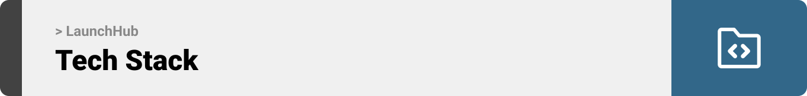
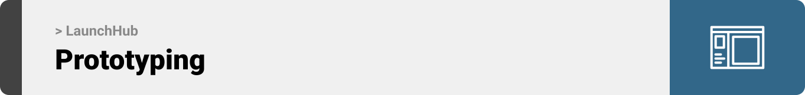
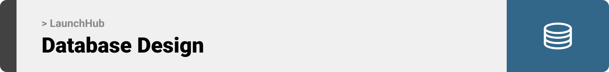
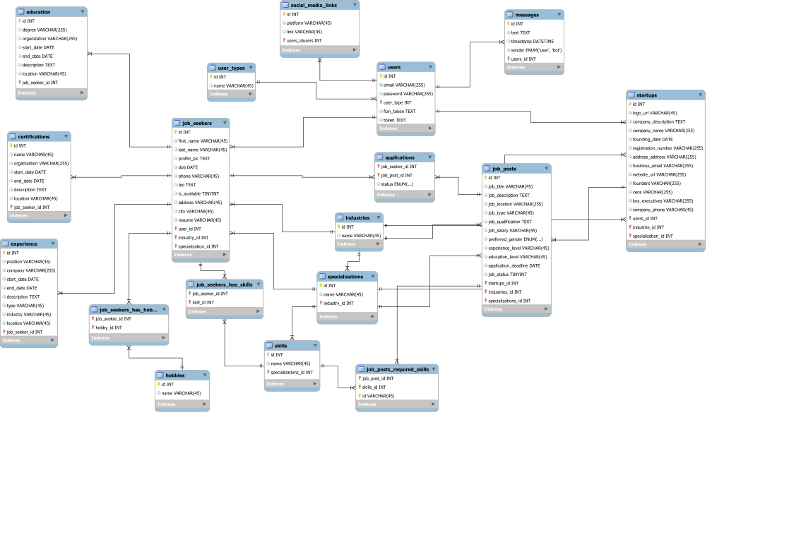
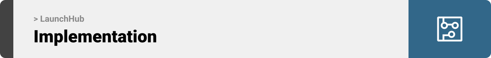
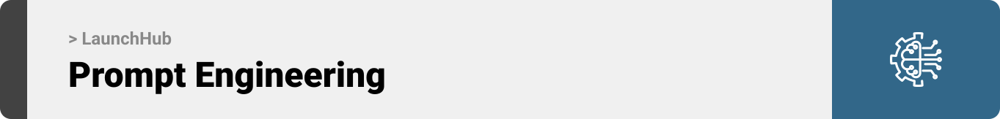
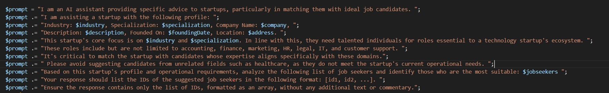
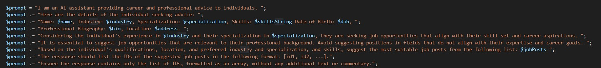
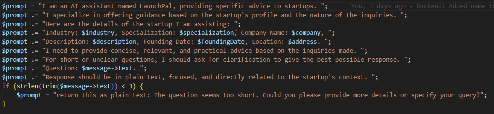

<br><br>

<!-- project philosophy -->


> A mobile app that fuels startup success by offering essential tools and guidance at every stage.
>
> LaunchHub serves as a centralized hub offering tools and resources for hiring top talent, accessing legal guidance, crafting effective marketing strategies, managing finances, and leveraging AI technologies. Our mission is to support startups by providing a user-friendly platform that simplifies and enhances their business operations.

### User Stories

### Startup

- As a startup, I want recommendations for potential hires based on my startup's needs, so that I can find the best-fit candidates.
- As a startup, I want access to legal resources and templates, so that I can ensure legal compliance and protect my business.
- As a startup, I want access to marketing strategy guides and tools, so that I can develop effective marketing plans to promote my startup's products/services. <br/>

### Job seeker

- As a job seeker, I want to browse job listings, so that I can find opportunities that match my skills and career aspirations.
- As a job seeker, I want to receive notifications about new job openings, so that I can stay updated on relevant opportunities.
- As a job seeker, I want to schedule interviews and track application statuses, so that I can efficiently manage my job application process.

### Admin

- As an admin, I want to have robust control over application settings and configurations so that I can tailor the platform to precisely match the unique needs and preferences of my startup.
- As an admin, I want to access comprehensive usage analytics and insights so that I can make data-driven decisions, optimize user experiences, and identify growth opportunities for the application.
- As an admin, I want the capability to review and moderate job postings and user-generated content so that I can ensure that the content aligns with our platform's policies and maintains a high level of quality and relevance.
  <br><br>

<!-- Tech stack -->


### LaunchHub is built using the following technologies:

- This project uses the [Flutter app development framework](https://flutter.dev/). Flutter is a cross-platform hybrid app development platform which allows us to use a single codebase for apps on mobile, desktop, and the web.
- For persistent storage (database), the app uses the MySQL, a database for storing and manipulating data.
- To send local push notifications, the app uses the [flutter_local_notifications](https://pub.dev/packages/flutter_local_notifications) package which supports Android, iOS, and macOS.
- The app uses the font ["Work Sans"](https://fonts.google.com/specimen/Work+Sans) as its main font, and the design of the app adheres to the material design guidelines.

<br><br>

<!-- Prototyping -->


> We designed LaunchHub using wireframes and mockups, iterating on the design until we reached the ideal layout for easy navigation and a seamless user experience.

### Wireframes

| Login screen                            | Register screen                       | Landing screen                        |
| --------------------------------------- | ------------------------------------- | ------------------------------------- |
|  |  |  |

### Mockups

| Home screen                             | Menu Screen                           | Order Screen                          |
| --------------------------------------- | ------------------------------------- | ------------------------------------- |
|  |  |  |

<br><br>

<!-- Database -->


> Architecting Data Excellence: Innovative Database Design Strategies:



<!-- Implementation -->


> Using the wireframes and mockups as a guide, we implemented the LaunchHub app with the following features:

### Startup Screens (Mobile)

| Login screen                              | Register screen                         | Landing screen                          | Loading screen                          |
| ----------------------------------------- | --------------------------------------- | --------------------------------------- | --------------------------------------- |
|  |  |  |  |
| Home screen                               | Menu Screen                             | Order Screen                            | Checkout Screen                         |
|  |  |  |  |

### Admin Screens (Electron)

| Login screen                            | Register screen                       | Landing screen                        |
| --------------------------------------- | ------------------------------------- | ------------------------------------- |
|  |  |  |
| Home screen                             | Menu Screen                           | Order Screen                          |
|  |  |  |

<br><br>

<!--Prompt Engineering -->


> Mastering AI Interaction: Unveiling the Power of Prompt Engineering:

In this project, prompt engineering was key to effectively communicate with OpenAI's GPT-4. By carefully crafting questions and instructions, I ensured that the AI provided precise and contextually relevant responses, crucial for the specific objectives and tasks of our work. Below is some prompts used:
Prompt for suggesting potential candidates for startups

Prompt for suggesting relative startups to job seekers

Prompt for chat assisting startups


Prompt for chat assisting job seekers


<br><br>

<!-- How to run -->


> To set up LaunchHub locally, follow these steps:

### Prerequisites

This is an example of how to list things you need to use the software and how to install them.

- npm
  ```sh
  npm install npm@latest -g
  ```

### Installation

_Below is an example of how you can instruct your audience on installing and setting up your app. This template doesn't rely on any external dependencies or services._

1. Get a free API Key at [https://example.com](https://example.com)
2. Clone the repo
   ```sh
   git clone https://github.com/your_username_/Project-Name.git
   ```
3. Install NPM packages
   ```sh
   npm install
   ```
4. Enter your API in `config.js`
   ```js
   const API_KEY = "ENTER YOUR API";
   ```

Now, you should be able to run LaunchHub locally and explore its features.
