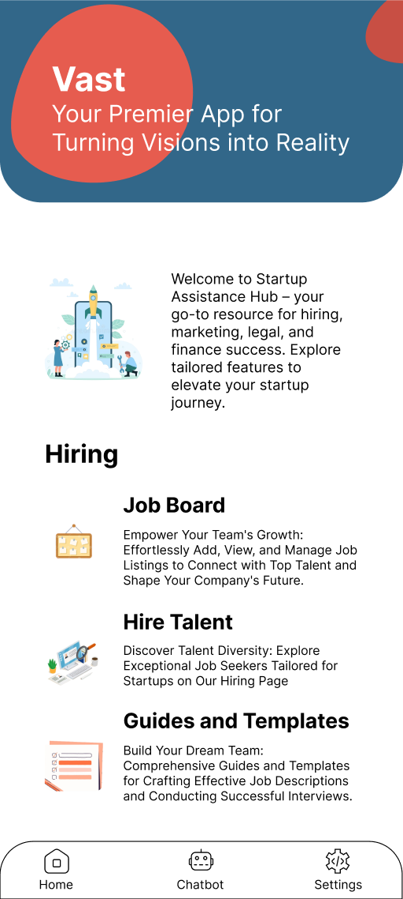
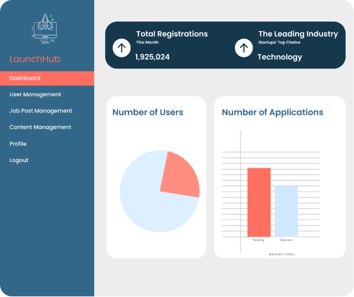
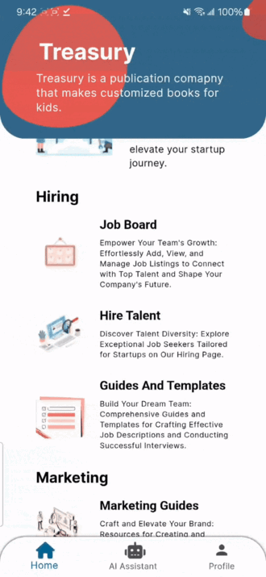
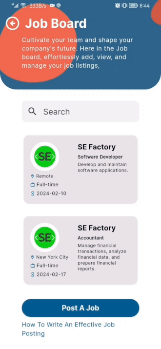
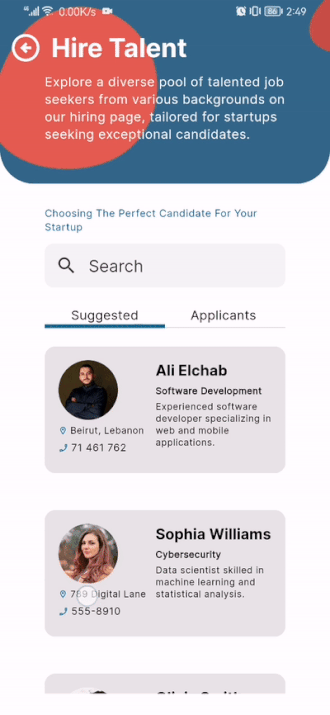
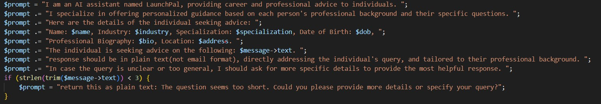

<br><br>

<!-- project philosophy -->


> A mobile app that fuels startup success by offering essential tools and guidance at every stage.
>
> LaunchHub serves as a centralized hub offering tools and resources for hiring top talent, accessing legal guidance, crafting effective marketing strategies, managing finances, and leveraging AI technologies. Our mission is to support startups by providing a user-friendly platform that simplifies and enhances their business operations.

### User Stories

### Startup

- As a startup, I want recommendations for potential hires based on my startup's needs, so that I can find the best-fit candidates.
- As a startup, I want access to legal resources and templates, so that I can ensure legal compliance and protect my business.
- As a startup, I want access to marketing strategy guides and tools, so that I can develop effective marketing plans to promote my startup's products/services. <br/>

### Job seeker

- As a job seeker, I want to browse job listings, so that I can find opportunities that match my skills and career aspirations.
- As a job seeker, I want to receive notifications about new job openings, so that I can stay updated on relevant opportunities.
- As a job seeker, I want to schedule interviews and track application statuses, so that I can efficiently manage my job application process.

### Admin

- As an admin, I want to have robust control over application settings and configurations so that I can tailor the platform to precisely match the unique needs and preferences of my startup.
- As an admin, I want to access comprehensive usage analytics and insights so that I can make data-driven decisions, optimize user experiences, and identify growth opportunities for the application.
- As an admin, I want the capability to review and moderate job postings and user-generated content so that I can ensure that the content aligns with our platform's policies and maintains a high level of quality and relevance.
  <br><br>

<!-- Tech stack -->


### LaunchHub is built using the following technologies:

- This project uses the [Flutter app development framework](https://flutter.dev/). Flutter is a cross-platform hybrid app development platform which allows us to use a single codebase for apps on mobile, desktop, and the web. We have used Flutter to implement the android mobile application Launchhub.
- For the server-side code, the app utilizes the Laravel framework. Laravel is a powerful and versatile PHP framework known for its elegant syntax and robust features. It's particularly favored for its expressive and clean code structure, comprehensive ecosystem, and extensive library of pre-built functions and tools. In our project, Laravel serves as the backbone for handling server-side logic, database interactions, API development, and providing a secure and scalable environment for the application backend. This integration ensures seamless communication between the Flutter front-end and server-side components, resulting in a cohesive and efficient user experience.
- For persistent storage (database), the app uses the MySQL, a database for storing and manipulating data.
- To send push notifications, the app uses the [Firebase Cloud Messaging](https://firebase.google.com/docs/cloud-messaging).
- For the admin dashboard, we utilized Electron with React, a powerful combination for building cross-platform desktop applications. Electron enables us to wrap the React application in a native desktop application environment, providing a seamless and integrated user experience. This approach allows for the creation of a sophisticated and responsive admin interface that is both visually appealing and functionally robust, enhancing the overall management and operational efficiency of our project.
- The app uses the font inter as its main font, and the design of the app adheres to the material design guidelines.

<br><br>

<!-- Prototyping -->


> We designed LaunchHub using wireframes and mockups, iterating on the design until we reached the ideal layout for easy navigation and a seamless user experience.

- Project Figma Design [Figma](https://www.figma.com/file/s3jSDlC2Y6bQ66UD89vdHp/LaunchHub?type=design&node-id=40%3A951&mode=design&t=loxRXuZyBbfaBCiV-1)

### Mockups

#### Mobile App

| Home screen                           | Ai Assistance                  | Hire Talent Screen                           |
| ------------------------------------- | ------------------------------ | -------------------------------------------- |
|  |  |  |

#### Admin Panel

| Dashboard                                  | User Management                             |
| ------------------------------------------ | ------------------------------------------- |
|  |  |

<br><br>

<!-- Database -->


> Architecting Data Excellence: Innovative Database Design Strategies:


<!-- Implementation -->


> Using the wireframes and mockups as a guide, we implemented the LaunchHub app with the following features:

### Startup Screens

| Sign Up Process                             | Home Screen                                    | Contact Advisors                       | Guides & Templates                       |
| ------------------------------------------- | ---------------------------------------------- | -------------------------------------- | ---------------------------------------- |
|         |              |  |      |
| Notifications                               | AI Assistant                                   | Job Board                              | Remove Job                               |
|  |                |  |  |
| Suggested Candidates                        | Contact / Reject Applicants                    | View Job Seeker Profile                | AI Assistant                             |
|      |  |    |          |

### Job Seeker Screens

| Apply For Job                       | AI Assistant                     | Related Articles & Courses                     | Edit Profile                               |
| ----------------------------------- | -------------------------------- | ---------------------------------------------- | ------------------------------------------ |
|  |  |  |  |

## Screenshots from the app

### Startup Profile

| Splash Screen                                           | Signup                                                      | Contact Advisors                                   |
| ------------------------------------------------------- | ----------------------------------------------------------- | -------------------------------------------------- |
|       |             |  |
| Suggested Candidates                                    | Candidates Profile                                          | AI Assistant                                       |
|  |  |        |
| Job Board                                               | Post A Job                                                  | Guides & Templates                                 |
|    |           |    |

### Job Seeker Profile

| Home                                                       | Job Opportunities                                             |
| ---------------------------------------------------------- | ------------------------------------------------------------- |
|  |    |
| AI Assistant                                               | Edit Profile                                                  |
|         |  |

### Admin Screens (Electron)

| Signin                                      | Dashboard                                             |
| ------------------------------------------- | ----------------------------------------------------- |
|  |           |
| User Management                             | Content Management                                    |
|   |  |

<br>

<!--Prompt Engineering -->


> Mastering AI Interaction: Unveiling the Power of Prompt Engineering:

In this project, prompt engineering was key to effectively communicate with OpenAI's GPT-4. By carefully crafting questions and instructions, I ensured that the AI provided precise and contextually relevant responses, crucial for the specific objectives and tasks of our work. Below is some prompts used:

Prompt for suggesting potential candidates for startups


Prompt for suggesting relative startups to job seekers


Prompt for chat assisting startups


Prompt for chat assisting job seekers



> AWS Deployment: Enhancing Project Capabilities

My project takes advantage of AWS's powerful cloud infrastructure for deploying my models. This integration allows us to handle increased traffic and data loads with ease, ensuring high availability and minimal downtime. AWS's tools and services provide the necessary flexibility and efficiency, making our AI solutions more accessible and reliable for users. <a href="./readme/aws-commands.md">Here</a> you would find the commands used to deploy on Amazon Linux server.
<br>

<!-- How to run -->


> Precision in Development: Harnessing the Power of Unit Testing:

This project number of unit tests implemented to ensure reliability and accuracy of code belwo are some if the unit tests runned on some of the projects funcitonalities

<br><br>

<!-- How to run -->


> To set up LaunchHub locally, follow these steps:

### Prerequisites

In order to run the mobile app, you should have an android physical phone with [developer mode enabled](https://www.samsung.com/uk/support/mobile-devices/how-do-i-turn-on-the-developer-options-menu-on-my-samsung-galaxy-device/). Or an emulator such as android studio, in order to run your android phone emulator and start the app.

### Installation

_Below is an example of how you can instruct your audience on installing and setting up Launchhub._

#### Mobile App:

1. Install Flutter SDK. Visit [Flutter website](https://docs.flutter.dev/get-started/install)
2. Run Flutter doctor in your terminal
   ```sh
   Flutter doctor
   ```
3. Clone the repository
   ```sh
   git clone https://github.com/Ali-Elchab/launchHub.git
   ```
4. Open the project
   ```sh
   cd launchhub/launchhub_frontend
   ```
5. Get Dependencies
   ```sh
   flutter pub get
   ```
6. Run the App
   ```sh
   flutter run
   ```
   Now, you should be able to run LaunchHub locally and explore its features.

#### Admin Dashboard:

1. Make sure you have Node.js and npm installed on your machine. you can download them from the [Node.js Website](https://nodejs.org/en)
2. Navigate to the electron project
   ```sh
   cd launchhub/admin_portal
   ```
3. Install Dependencied
   ```sh
   npm install
   ```
4. Start the desktop app

   ```sh
   npm run dev
   ```

   Now, you should be able to run LaunchHub Admin Portal locally and explore its features.
